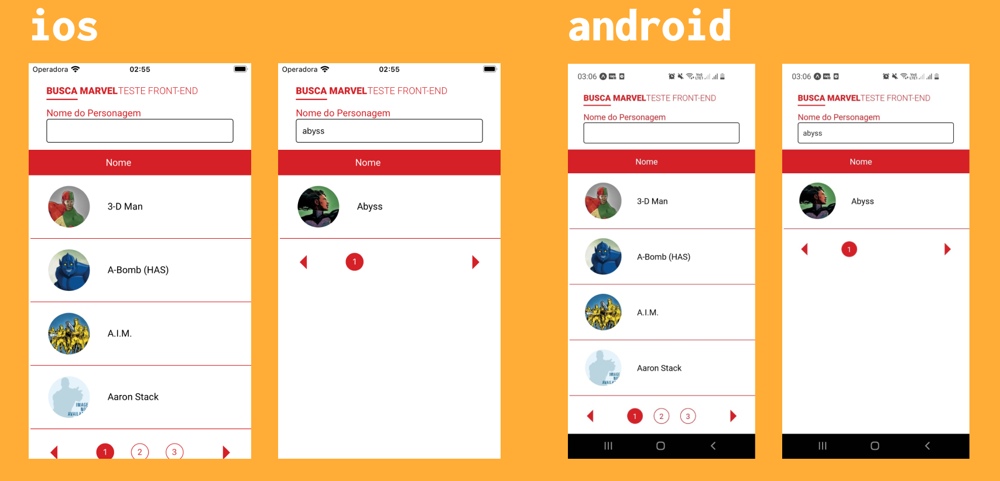

# MARVEL APP


;


# **📌 Resumo**

MARVEL APP é um app para consulta de listagem de todos os heróis da marvel.

---

# **🚀 Features**

- Listagem dos heróis
- Paginação
- Busca por nome

---

# Para rodar este projeto

- Rodar projeto no emulador

```tsx
git clone https://github.com/isaquem18/teste-rn-marvel.git

~ yarn 
~ expo start
```

Depois, basta ler o qrcode.

---

# **📮 Faq**

O app foi construído com **react-native** com typescript e expo, Context-Api para compartilhamento dos estados globais, styled-components como lib de estilos e Axios para requisições à API.
